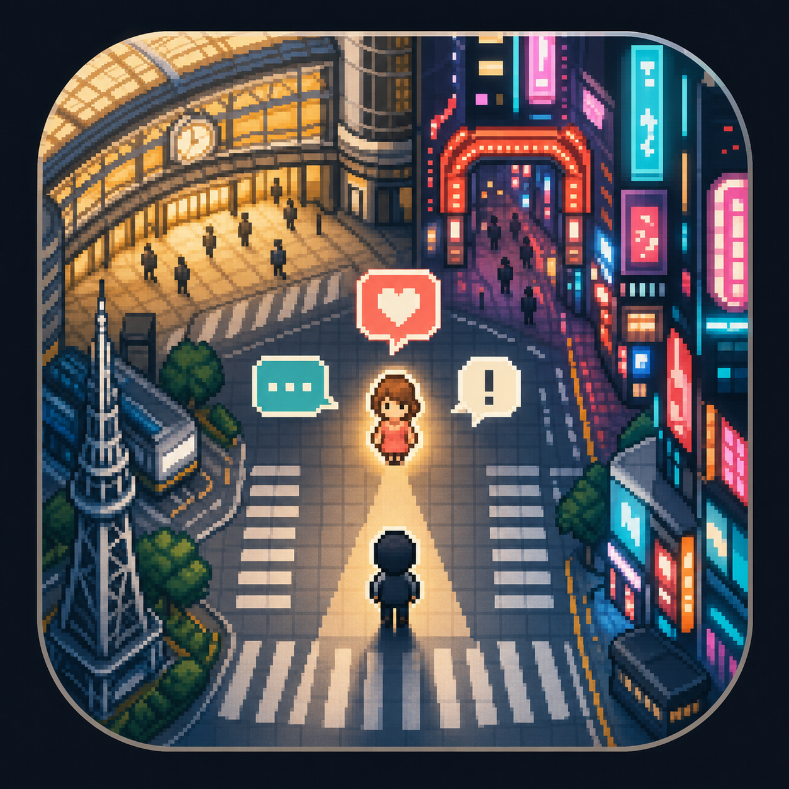
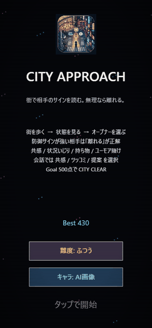

# city-approach

街で相手のサインを読み、声をかけるか離れるかを判断するPhaser 3製の2Dゲームです。ブラウザだけで動き、GitHub Pagesにそのまま置けます。



## Demo



[WebM版を見る](./assets/demo.webm)

## GitHub About

- Description: 街で相手のサインを読み、距離感と会話の文脈を判断するブラウザ2Dゲーム
- Website: GitHub Pagesの公開URL
- Topics: `phaser`, `browser-game`, `javascript`, `pixel-art`, `github-pages`, `city-game`

## ゲーム内容

- 名古屋駅と歌舞伎町を切り替えながら、NPCの行動サインを観察する。
- 声かけは「お天気op」「服装op」「小物op」「ネタop」から選択する。
- 防御サインが強い相手には「離れる」が正解になる。
- 会話に入ると、共感・ツッコミ・提案を選ぶ短い会話バトルに進む。
- 500点でCITY CLEAR。Bestとランク更新を狙って続行できる。

## ローカル起動

```bash
python -m http.server 8000 --bind 127.0.0.1
```

ブラウザで `http://127.0.0.1:8000/` を開きます。

## Smoke test

```bash
node smoke.mjs
```

## 調査メモとゲーム反映

### 名古屋駅

- 中央通路が桜通口と太閤通口を結び、金時計・銀時計が待ち合わせ地点になっている。ゲームでは横長の中央コンコース、両端の時計、改札前の停止ポイントとして反映。
- 金時計周辺は待ち合わせ人数が多く、改札前・時計前で立ち止まる行動が起きやすい。ゲームでは「待ち合わせ系」「スマホ」「立ち止まり」のNPCを出し、成功率を少し上げる一方、人混みの距離感も判定する。
- 朝夕ラッシュは交通量が増えるため、昼は比較的判断しやすく、夕方寄りの混雑は失敗要因になる。ゲームでは名古屋駅を直線的な人流、NPCの規則的な移動で表現。

### 歌舞伎町

- 国内外から人が集まる繁華街で、夜はネオン、飲食・娯楽施設、観光客で密度が高い。ゲームでは暗い路面、ネオン看板、ランダムな群衆移動、ノイズペナルティで反映。
- 客引き・路上勧誘は新宿区の条例や警察の注意喚起対象。ゲームでは「夜の警戒」「声かけが多い」という会話行にし、違和感ゲージが上がりやすい設計にした。
- 単独よりグループ行動の防御力が高く、流れを止める声かけは失敗しやすい。ゲームでは「友達同伴系」に大きめの成功率マイナスを設定。

## キャラクター抽象化

```js
{
  type: "忙しい系",
  traits: ["スマホ", "歩くの速い", "外界遮断"],
  difficulty: "高",
  effective_actions: ["短く要点", "邪魔しない"],
  bad_actions: ["長話", "距離詰め"]
}
{
  type: "待ち合わせ系",
  traits: ["立ち止まり", "スマホ", "待ち合わせ"],
  difficulty: "低",
  effective_actions: ["軽く", "状況ツッコミ"],
  bad_actions: ["長話", "距離詰め"]
}
{
  type: "友達同伴系",
  traits: ["友達といる", "周囲を見る"],
  difficulty: "高",
  effective_actions: ["グループの邪魔をしない", "短く"],
  bad_actions: ["一人だけに強く行く", "距離詰め"]
}
{
  type: "目線あり系",
  traits: ["目が合う", "歩くの遅い"],
  difficulty: "中",
  effective_actions: ["軽く", "自然な提案"],
  bad_actions: ["強すぎる直球"]
}
{
  type: "イヤホン系",
  traits: ["イヤホン", "外界遮断", "歩くの速い"],
  difficulty: "高",
  effective_actions: ["邪魔しない"],
  bad_actions: ["急に割り込む", "長話"]
}
```

## 実装方針

- NPCは抽象化したtraitsをランダム合成し、traitsごとに成功率補正を加える。
- 名古屋駅は直線移動と停止ポイント、歌舞伎町はランダム移動と高密度の環境ノイズで差を出す。
- 16x16/32x32系のトップダウンドットを参考に、完全オリジナルの32x32 PNGを8色以内で作成。
- 実在人物の再現、特定の文化や個人への偏見を助長する表現は入れない。見た目ではなく「行動サイン」をゲーム判定に使う。

## 参考にした情報

- Nagoya Station: https://www.nagoyastation.com/nagoya-station-map-finding-your-way/
- 名古屋駅の待ち合わせスポット: https://sotokoto-online.jp/life/10262
- 新宿区 歌舞伎町地区のまちづくり: https://www.city.shinjuku.lg.jp/kusei/keikan01_001083.html
- 新宿区 客引き行為等の防止: https://www.city.shinjuku.lg.jp/anzen/kikikanri01_000001_00057.html
- 警視庁 Tips for Safe Drinking in Shinjuku: https://www.keishicho.metro.tokyo.lg.jp/about_mpd/shokai/ichiran/kankatsu/shinjuku/about_ps/safe_drinking.files/English.pdf
- JNTO Kabukicho: https://www.japan.travel/en/spot/1668/
- Phaser CDN利用: https://docs.phaser.io/phaser/getting-started/installation
- Pixel art参考: https://coldrice.itch.io/top-down-pixel-art-sprites-16x16
- Pixel tile参考: https://philtacular.itch.io/top-down-kingdom
